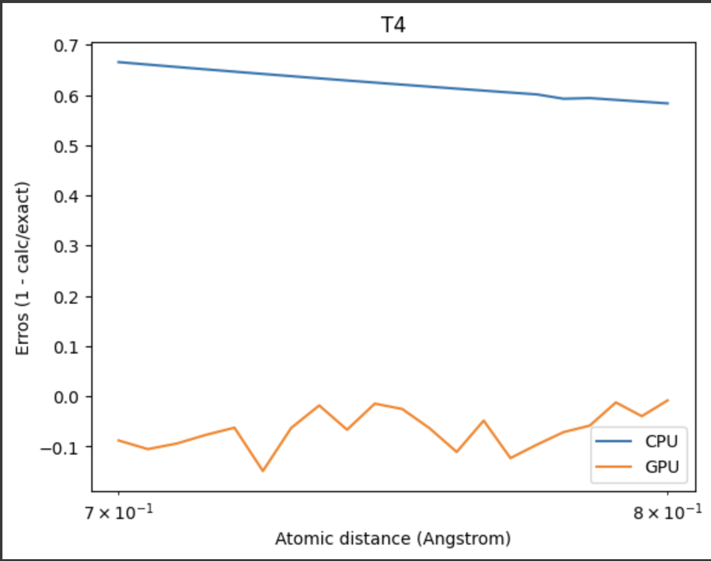
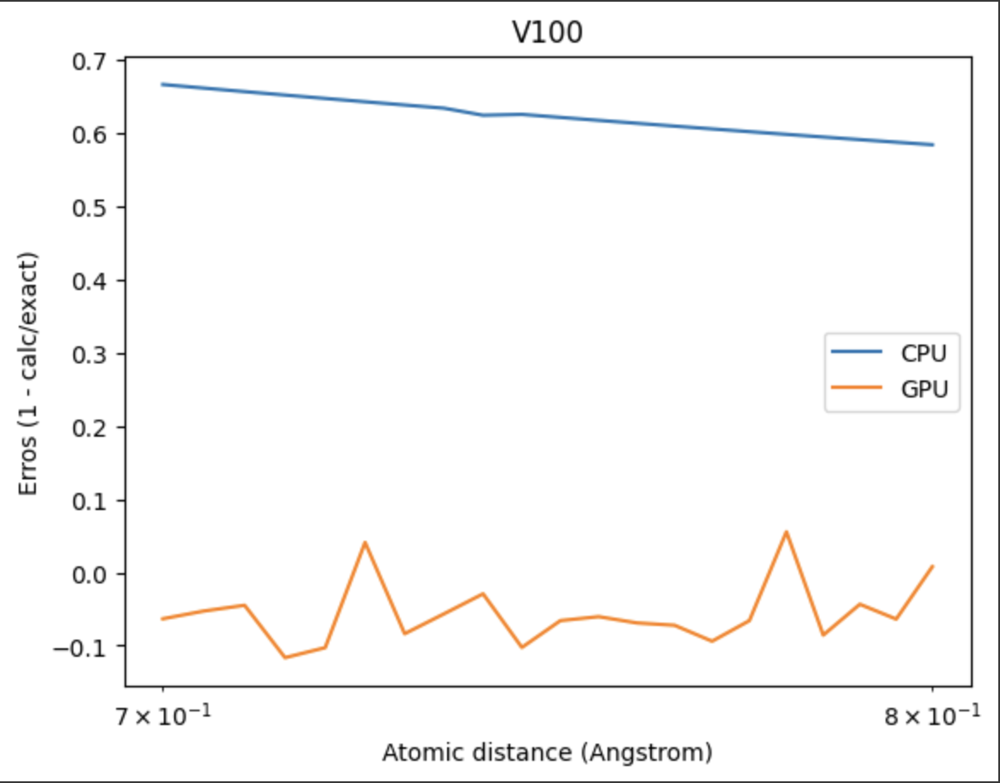
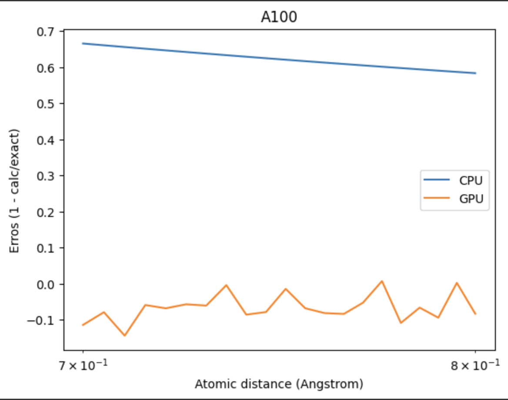
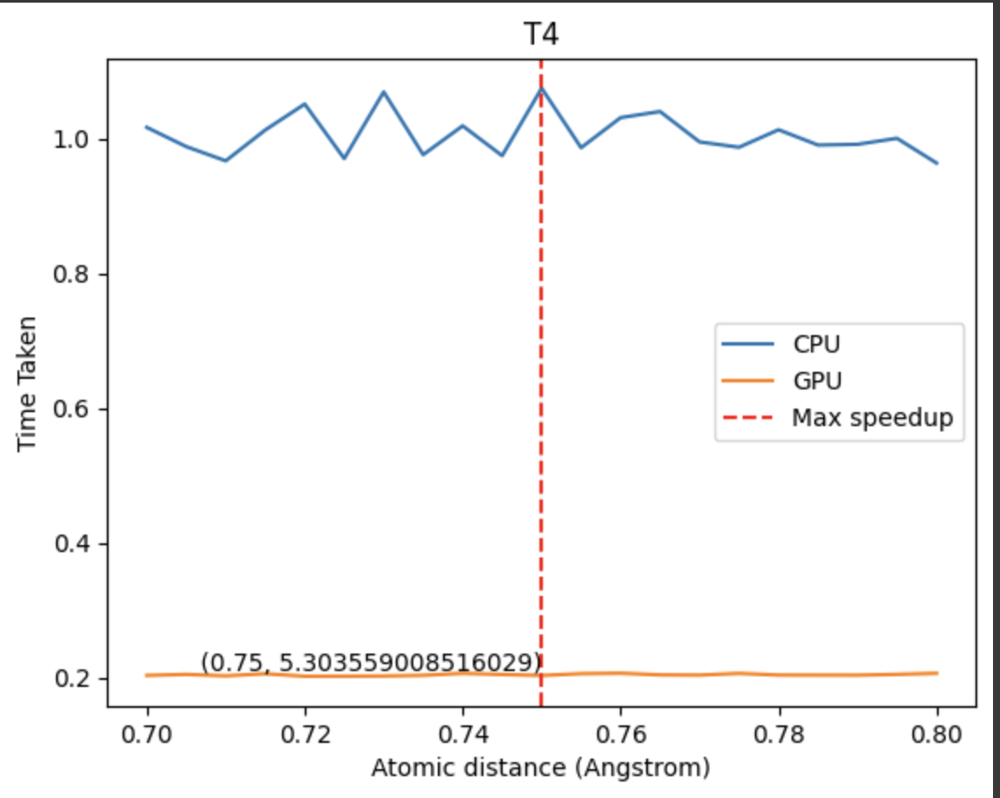
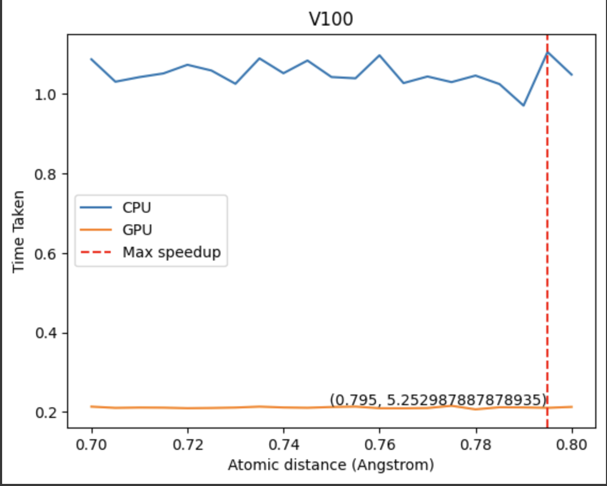
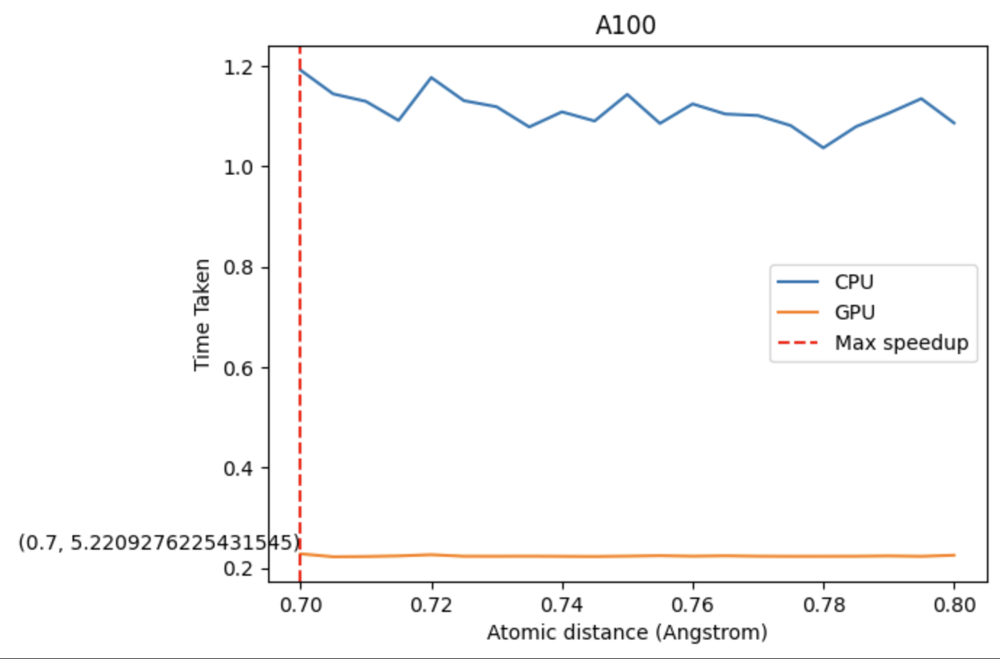
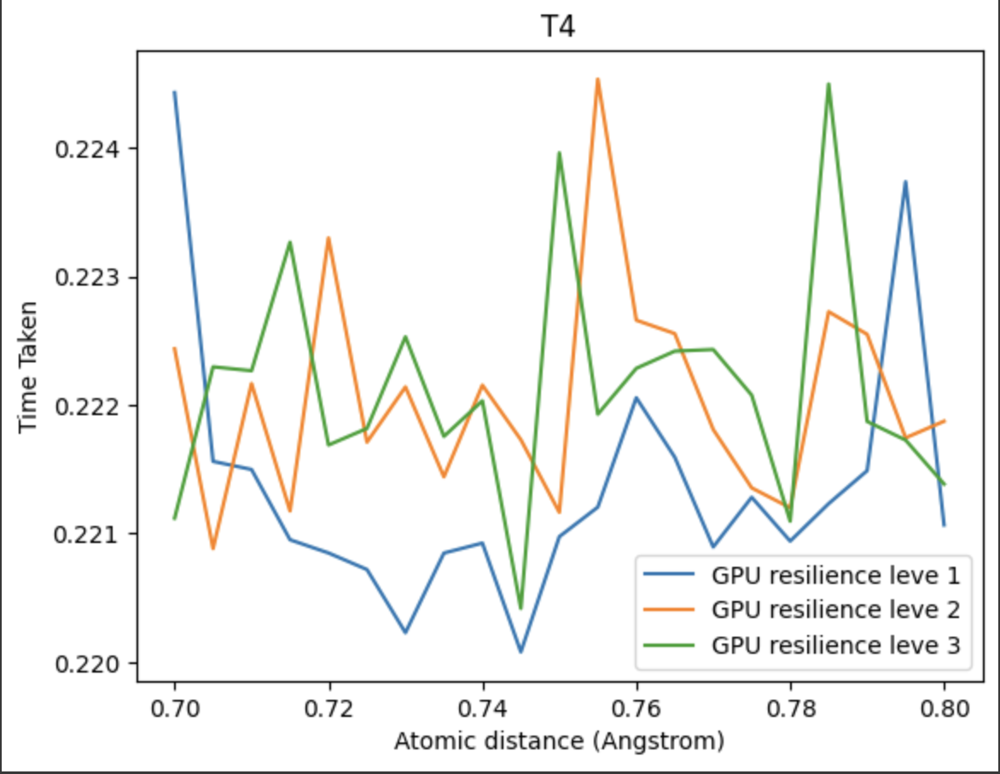
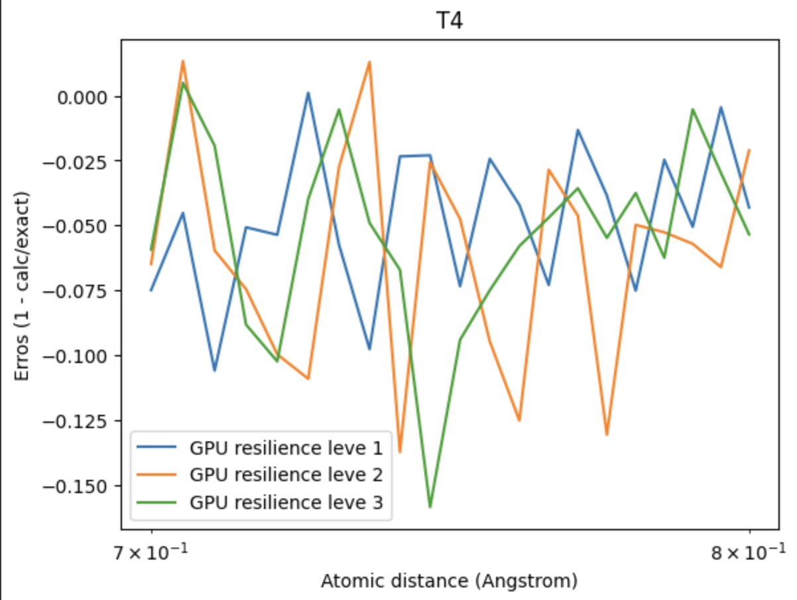

# QOSF-2023-24

# H2

- Abstract
  

- Comapring Errors between Exact energy and GPU/CPU Energy

  

- Comparing Times between CPU and GPU times averaged over `50`

  

- Compairing with resilience level
  

- Compairing noisy simulation against GPU

- Compairing GPU vs QPU
  
- Summary of Data

# LiH
