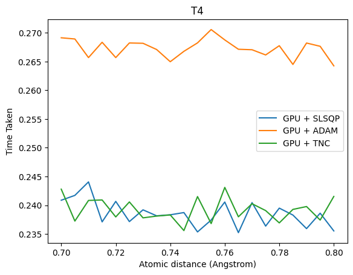
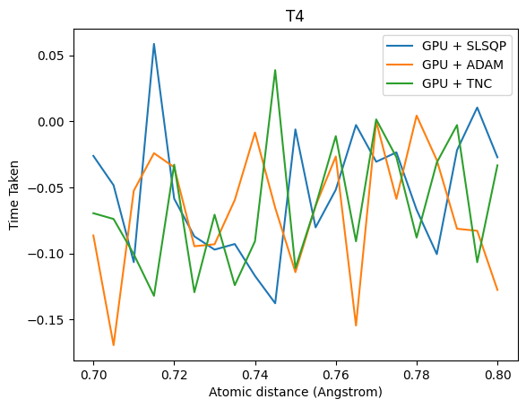
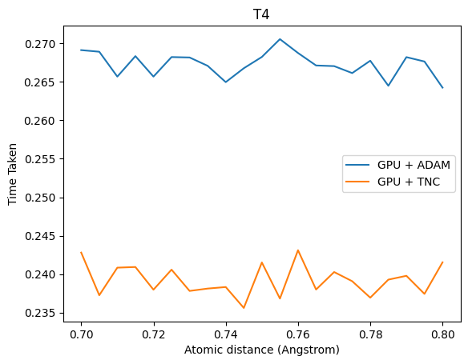
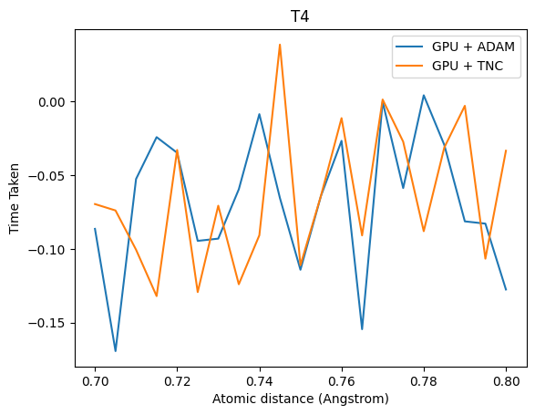
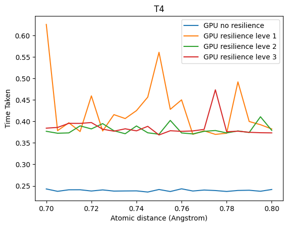
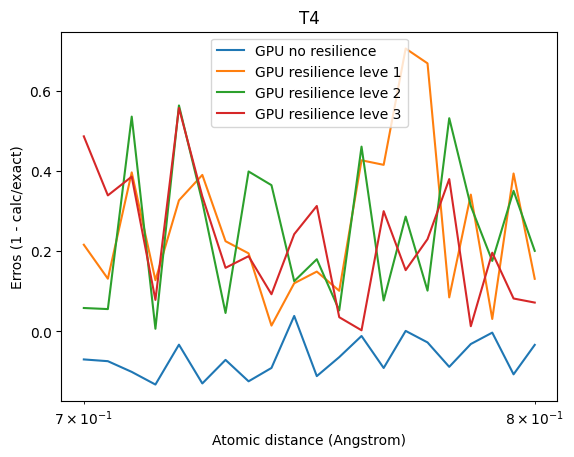
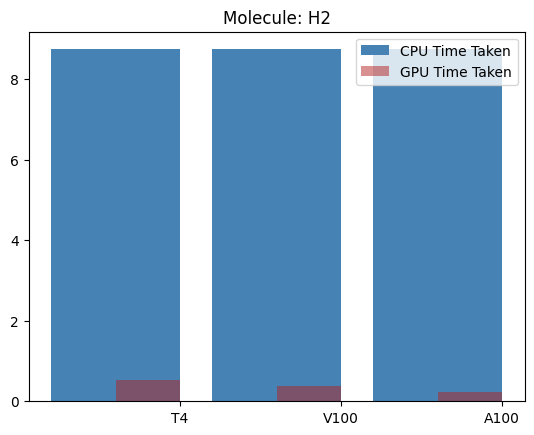
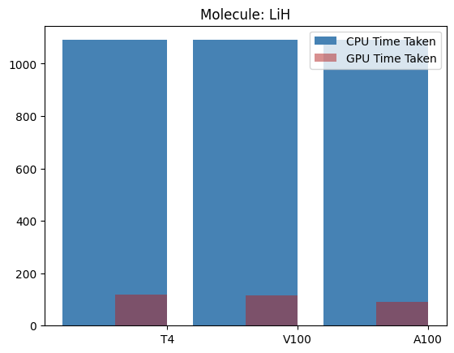

# QOSF-2023-24

## Evaluating Qiskit VQE on GPU vs CPU: A Comparative Study Under Limited Compute Resources

## Abstract

This study presents a focused evaluation of quantum computing simulations using the Variational Quantum Eigensolver (VQE) algorithm for the Hydrogen molecule (H2) system, comparing the performance of Qiskit Aer on NVIDIA's A100 GPU, V100 GPU, T4 GPU, against Qiskit Estimator on a standard CPU, under limited computational resources. Emphasizing practical constraints faced in quantum research, we benchmark these platforms for the specific implementation of VQE, a pivotal algorithm in quantum chemistry. The analysis spans across computational efficiency, scalability, and adaptability to different hardware configurations. We further assess the resilience of these simulators in handling computational errors and disruptions, a critical aspect for reliable quantum simulations. The study also delves into the optimization capabilities within Qiskit, examining how different optimizers influence the VQE implementation on these contrasting platforms. Our findings provide essential insights for researchers and practitioners in quantum computing, guiding the optimal utilization of simulation tools for efficient and accurate quantum chemical computations, particularly in resource-limited scenarios.  

## Introduction
In order to understand a molecule properties such as ground state energy play an essential role, prediciting its chemical and physical properties.  Knowing the ground state energy helps determinte the stability and reactivity of a moleule, and how it interacts with another molecule. These properties can have help predict behavior of substances before synthesising in labs, thus saving time and resources in material science or drug discovery. 

However, solving for ground state energy of molecules is difficult on classical computers due to complex nature of interactions involved within a molecule. Molecular simulation problems grow exponentially with the increase in number of particles, making it infeasible for classical computers. This computational challenges can be solved using quantum computing algorithms like `Variational Quantum Algorithms`.

Variational Quantum EigenSolver (VQE) algorithms is a hybrid quantum-classical algorithm that uses variational technique to find minimum eigen values of a Hamiltonian. I have a VQE Tutorial explaining steps involved for VQE implementation from scratch, do check it out [here](https://github.com/tinaoberoi/Tutorial_VQE/blob/main/part2_tutorial.ipynb). This tutorial explains a step by step process for finding ground state energy of  `LiH` molecule.

In this project we implement VQE using qiskit both for H2 and LiH molecules.
## Approach for VQE qiskit implementation

1. Using Drivers to extracts information
   Qiskit has drivers that act as interfaces to classical chemistry. The available drives are as follows `PSI4Driver`, `PyQuanteDriver`, `PySCFDriver` are available.
   In our case we are using `PySCFDriver`. 
   
   ```python
    geometry = (["H", "H"], [(0.0, 0.0, 0.0), (0.0, 0.0, 0.735)], charge=0, multiplicity=1)
    molecule = MoleculeInfo(geometry)
    driver = PySCFDriver.from_molecule(molecule, basis="sto3g")
    problem = driver.run()
    ```
2. Map molecular Hamiltonians to qubit Hamiltonians

    For these transformations here we have used `Jordan Wigner` transformations. Used as 
    ```python
    mapper = JordanWignerMapper()
    qubit_op = mapper.map(problem.second_q_ops()[0])
    ```
3. Create an ansatz
    One of the crucial steps in VQE to final ground state is choosing the correct ansatz. Here we are using the `Unitary Coupled-Cluster Ansatz (UCC)`. 
    ```python
    ansatz = UCCSD(
        problem.num_spatial_orbitals,
        problem.num_particles,
        mapper,
        initial_state=HartreeFock(
            problem.num_spatial_orbitals,
            problem.num_particles,
            mapper,
        ),
    )
    ```

4. Choosing Optimizers
    In accordance with the variational method, its parameters must be optimized to minimize the expectation value of the target Hamiltonian. We start with the optimizer popular for supressing noise `equential Least Squares Programming optimizer (SLSQP)`.

## Accelerating implementation using GPUs

The hybrid-classical approach has the capability to leverage the power of GPU's, the classical part of the algorithm could be accelerated on GPU platforms helping to achieve better performance. For example: Finding ground state energy of LiH takes around 20min for each run and with GPU this could be reduces to around 2 min.

For using GPU qiskit has `AerSimulators` and you can set options to use GPU.
```python
gpu_estimator = AerEstimator(
  run_options={"seed": seed},
  transpile_options={"seed_transpiler": seed},)
gpu_estimator.set_options(device='GPU')
gpu_estimator.set_options(cuStateVec_enable=True)
```

## Results
- Comparing Errors between Exact energy and GPU/CPU Energy


- Comparing Times between CPU and GPU times averaged over `50`


As expected the GPU performed better than the CPU based simulators. The maximum performance achieved is `5x` using `SLSQP` optimizers.

For better understanding lets compare multiple optimizers for the best suitable optimizer for our use case.


After compairing different optimizers, the top three performers both in terms of performance and errors are 

<ul>
  <li> ADAM
  <li> SLSQP
  <li> TNC
</ul>

On comparing among the top 3 candidates,





ADAM and TNC clearly performed better than SLSQP. On comparison between the two TNC seemed to perform the best among three in terms of performance and error percentage is similar in all three.





For the next phase we compare how resilience level affect the performance while improving the error percentages on `TNC`.

- Compairing with resilience level

The parameter `resilience level` provide error corrections.






We can see that suing `resilience levels` increase the time taken, but at the same time there is not much improvement in `errors`.

Thus we will be using `no resilience level` for performance measurement.

## Conclusion

Using the optimum setup for VQE we benchmark the performance of VQE qiskit implementation for `H2` and `LiH` molecule on 3 GPU platforms`T4`, `V100` and `A100`.

**For H2**
<hr>



**For LiH**
<hr>



Benchmarking results

| Molecule | Performance on T4 | Performance on V100 | Performance on A100 |
| -------- | ----------------- | ------------------- | ------------------- |
| LiH      | 9x                | 9.5x                | 12.1x               |
| H2       | 16x               | 23x                 | 36.25x              |


Using qiskit's GPU enable Aer simulators we succesfully benchmarked VQE algorithms. Achieving a maxium performance of `36x` in case of H2 molecule and `12x` in case of LiH molecule. 

