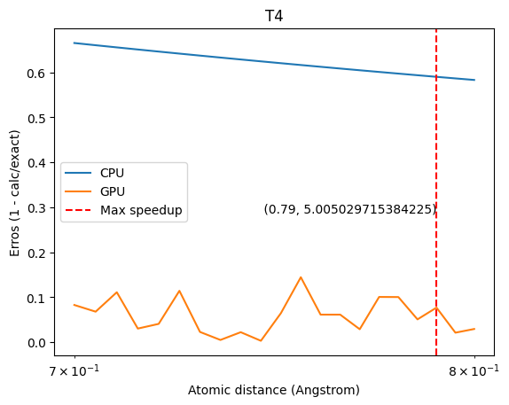
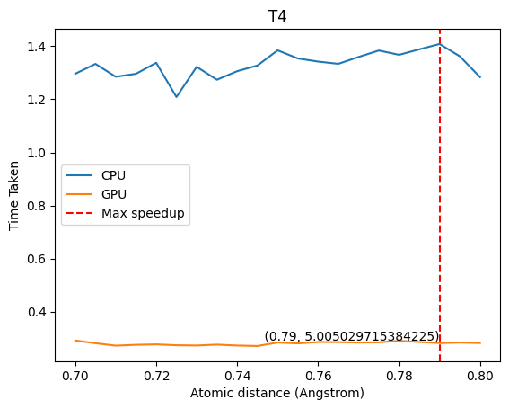
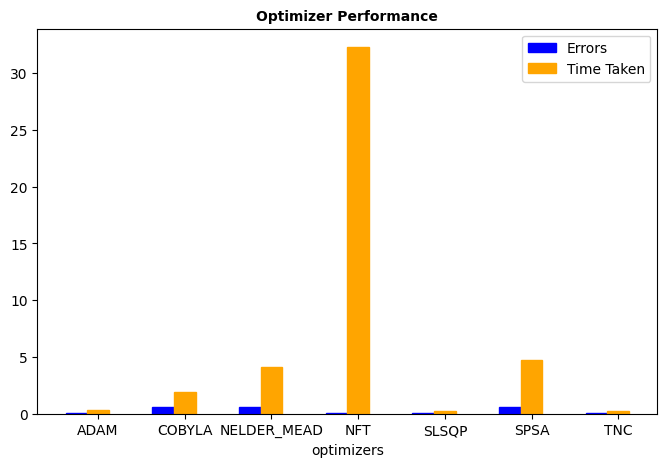
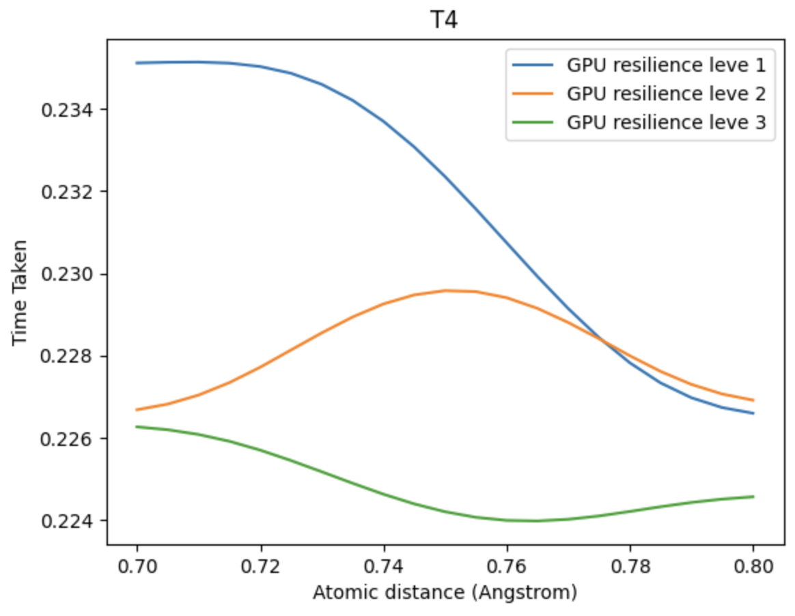
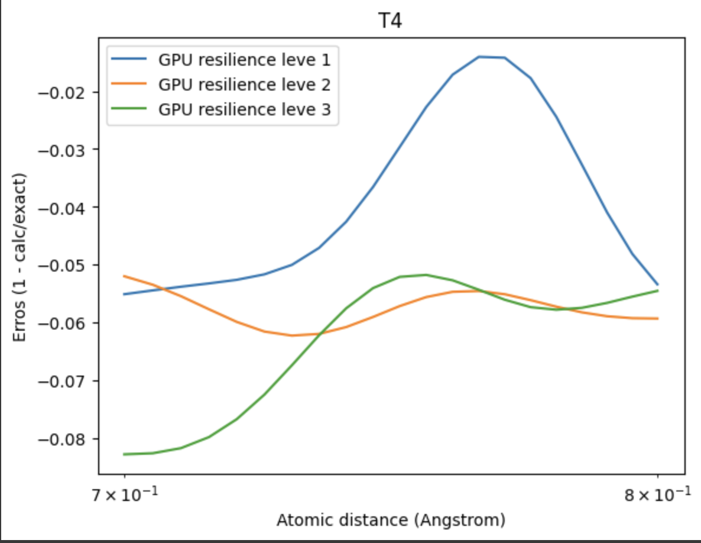
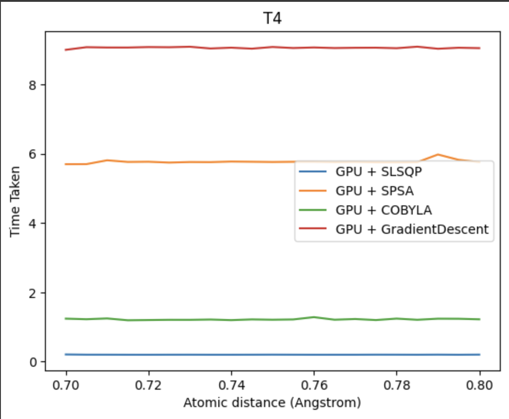
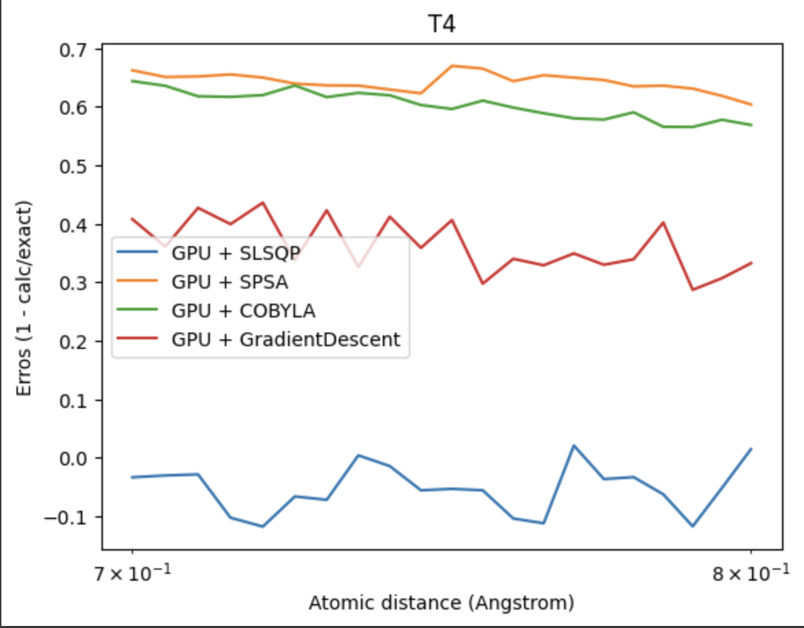

# QOSF-2023-24

## Title
Title: Evaluating Qiskit Aer on A100 GPU vs Qiskit Estimator on CPU: A Comparative Study Under Limited Compute Resources

## Abstract

This study presents a focused evaluation of quantum computing simulations using the Variational Quantum Eigensolver (VQE) algorithm for the Hydrogen molecule (H2) system, comparing the performance of Qiskit Aer on NVIDIA's A100 GPU, V100 GPU, T4 GPU, against Qiskit Estimator on a standard CPU, under limited computational resources. Emphasizing practical constraints faced in quantum research, we benchmark these platforms for the specific implementation of VQE, a pivotal algorithm in quantum chemistry. The analysis spans across computational efficiency, scalability, and adaptability to different hardware configurations. We further assess the resilience of these simulators in handling computational errors and disruptions, a critical aspect for reliable quantum simulations. The study also delves into the optimization capabilities within Qiskit, examining how different optimizers influence the VQE implementation on these contrasting platforms. Our findings provide essential insights for researchers and practitioners in quantum computing, guiding the optimal utilization of simulation tools for efficient and accurate quantum chemical computations, particularly in resource-limited scenarios.  

## Results
- Comparing 
- Comparing Errors between Exact energy and GPU/CPU Energy

- Comparing Times between CPU and GPU times averaged over `50`

As expected the GPU performed better than the CPU based simulators. The maximum performance achieved is `5x` using `SLSQP` optimizers.

For better understanding lets compare multiple optimizers for the best suitable optimizer for our use case.

After compairing different optimizers, the top three performers both in terms of performance and errors are 

<ul>
  <li> ADAM
  <li> SLSQP
  <li> TNC
</ul>

For the next phase we compare how resilience level affect the performance while improving the error percentages on `TNC`.

- Compairing with resilience level
  
 

After smoothening using `savgol_filter`

 

- Compairing simulators
  
  

## Summary of Data
  
  - The qiskit `cudastatevec` GPU estimator outperforms qiskit estimator in terms of error and time. 
  - The time and error comparison based on different resilience levels in qiskit is validated.
  - The best performing optimizer in terms of performance and error for VQE H2 use case is `SLSQP`

